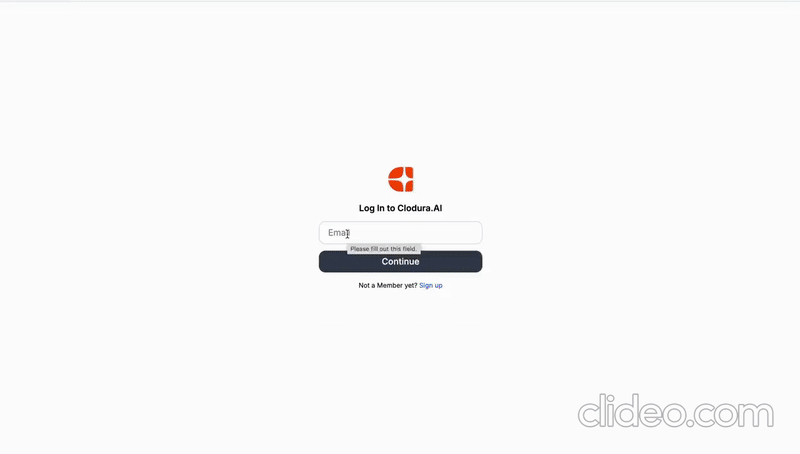
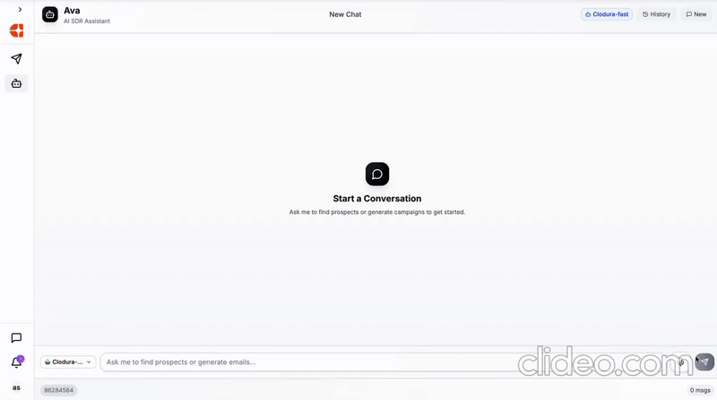

# AVA - AI SDR Assistant Backend

**AVA** is an AI-powered voice command supported chatbot SDR (Sales Development Representative) assistant backend designed to help sales teams discover relevant leads, suggest outreach emails, create cadences of 100s of people with suggested email by just one command and manage interactions intelligently. automatically provides titles to each chat sessions. Built with FastAPI, AVA integrates advanced LLMs and external APIs to streamline your sales workflow.

---

## 📁 Project Structure

- `routes.py` — FastAPI route handling for chat interactions and tool calls  
- `agent.py` — Manages OpenRouter interaction, model response handling, and memory  
- `tools/search_tool.py` — Unified lead search for contacts and companies via external API  
- `tools/suggest_email_tool.py` — Generates email suggestions based on contact and company context  
- `enum_matcher.py` — Utility for semantic/enumeration matching of filter values  
- `enum_data/` — Folder to store enums for different fields  
-  `storage/` - File storage

---
## DEMOS

**LOGIN TO YOUR ACCOUNT---**


**SEARCH FOR LEADS---**


**SEARCH FOR COMPANIES---**


**SEND EMAIL TO HRS---**


## 🚀 Getting Started

### 1. Clone the Repository

```bash
git clone https://github.com/anushka192001/Sales-dev-assistant.git
```

### 2. Create a Virtual Environment (Recommended)

```bash
python3 -m venv venv
source venv/bin/activate
```

### 3. Install Dependencies

```
Docker
Mongodb
```

### 4. Configure Environment Variables

Create a `.env` file in the root directory and add:

```env
OPENROUTER_API_KEY=your_openrouter_api_key
CLODURA_TOKEN=your_clodura_token
USER_ID=clodura_user_id
```

---

## 🏃‍♂️ Running Locally

### Build the docker image and run it
```bash
  docker-compose up --build
```

The API will be available at [http://locathost:3000).

---

## 📚 API Endpoints

- `GET /` — Health check
- `POST /chat` — Main chat endpoint for interacting with the AI Sales Assistant
- `GET /session/{session_id}` — Get session info
- `DELETE /session/{session_id}` — Clear a session
- `GET /docs` — Interactive API documentation (Swagger UI)

---

